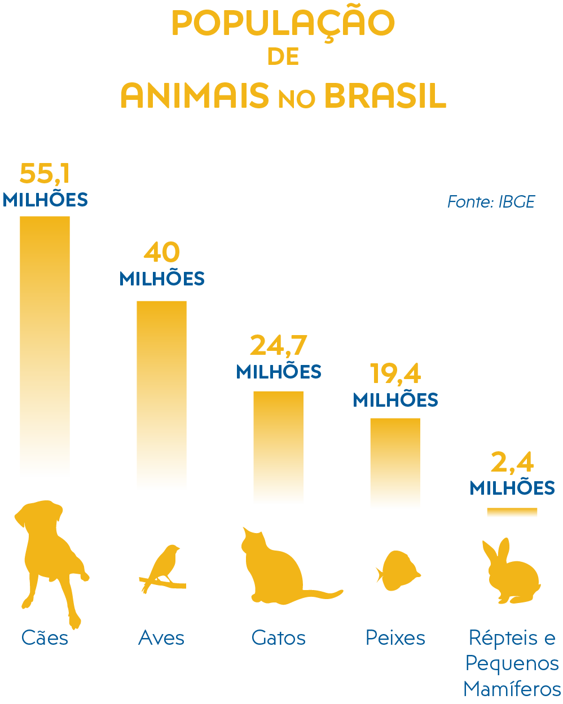

# Projeto Trabalho de Graduação em Banco de Dados I

## TEMA: APLICAÇÃO MOBILE PARA ADOÇÃO DE ANIMAIS DOMESTICOS

### 1. INTRODUÇÃO
Em todo território nacional estima-se aproximadamente 139,3 milhões de animais de estimação, contabilizados no país 54,2 milhões de cães; 39,8 milhões de aves; 23,9 milhões de gatos; 19,1 milhões de peixes e 2,3 milhões de répteis e pequenos mamíferos de acordo com dados levantados pelo IBGE e atualizados pela inteligência comercial do Instituto Pet Brasil (IPB), em 2018. Com base nesse levantamento pressupõem que a maior concentração de animais domésticos se encontra na região sudeste cerca de 50%, esses números confirmam a tendência de cada vez mais pessoas e famílias buscando animais de estimação.

A Organização Mundial da Saúde estima que só no Brasil existem mais de 30 milhões de animais abandonados, entre 10 milhões de gatos e 20 milhões de cães, além dos 3,9 milhões de animais em condição de vulnerabilidade (ACV) aqueles que vivem sob o cuidado das famílias classificadas abaixo da linha de pobreza, ou que vivem nas ruas, mas recebem cuidados de pessoas. Muitos animais abandonados, na qual vivem sob os cuidados de Organizações não Governamentais (ONGs), denominadas popularmente como Proteção Animal, ou protetores que assumem a responsabilidade de manter esses animais.

E promover a adoção voluntária além do mais a castração para controle de reprodução populacional de cães e gatos e prevenção de proliferação de doenças reprodutivas transmissíveis entre os animais, assim evitando as ninhadas indesejadas e o consequente abandono.

 <b>Figura 1.1 – População de Animais no Brasil</b> 
 
  Fonte: Instituto Pet Brasil Base IBGE (2013)

O levantamento do Instituto Pet Brasil apurou a existência de 370 ONGs atuando na proteção animal. Dessas 46%, ou 169 ONGs, estão na região Sudeste, seguida pelas regiões Sul (18%), Nordeste (17%), Norte (12%) e, por fim, Centro-Oeste (7%). Essas instituições tutelam mais de 172 mil animais. Desses, 165.200 (96%) são cães e 6.883 (4%) são gatos. As ONGs e protetores forneceram informações diversas sobre a sua capacidade de acolhimento e o acolhimento real do momento, e o mais preocupante que esses dados revelam, o crescimento efetivamente de animais em condições de vulnerabilidade para abandono completo.

Sem ajuda, cuidado e ação de Ongs ou protetores e até mesmo de pessoas que se sensibilizam com estes animais em condição de abandono, eventualmente esses dados tendem a crescer a cada vez mais. No entanto promovendo a adoção doméstica e o zelo permite que animais sejam adotados e consequentemente mais animais resgatados em condição de abandono.

Uma luta constante para redução de animais maltratados ou animais abandonados que vivem na rua se torna cada vez mais difícil. Milhares de pessoas veem animais sendo maltratados nas ruas, nas vizinhanças ou em qualquer lugar que eles possam estar. Maus tratos é sinônimo de tratamento inadequado do animal, segundo as necessidades específicas de cada espécie como mantê-lo preso em locais sem ventilação ou mesmo trancado em ambientes pequenos, não o alimentar de forma adequada e diariamente; ou seja, violando qualquer medida que garanta o bem estar do animal.

O abando de animais permanece como um dos maiores problemas enfrentados por ONGs ou protetores, na qual lindam com o desafio de animais largados em praças, estradas ou deixados em suas portas. Largar um animal em um abrigo temporário não se torna menos grave do que do que abandoná-lo. Em um abrigo ele vai ter uma vida difícil, quando ele entra em um abrigo, vai ter de disputar espaço com outros cães. Com isso o abandono ou troca de família pode gerar traumas e, consequentemente, o desenvolvimento de determinadas compulsões como ansiedade e agressividade.

Maus tratos intencionais e não intencionais e abandono de animais é crime e está previsto no artigo 32 da lei 9.605/98, a pena é de três meses a um ano de detenção além de multa. Se houver morte do animal a pena é aumentada em um sexto a um terço, A mesma que criminaliza, “praticar ato de abuso, maus-tratos, ferir ou mutilar animais silvestres, domésticos ou domesticados”. Apesar disso, pode-se afirmar que na maioria das vezes quem pratica esse crime acaba impune, pelo abandono de animais ser um crime silencioso.

Além do abandono acarretar grandes problemas, causando prejuízos para a ecologia, economia, e principalmente saúde pública, devido a possibilidade de um aumento nos casos das zoonoses municipais como número de chamadas para resgates de animais doentes, fêmeas gestantes ou recém-paridas, mas também proliferação de doenças como raiva, verminoses, parvovirose podendo sofrer de fome, desnutrição, parasitas, doenças, envenenamento e outras formas de abuso. 

Ainda mais podendo aumentar a reprodução populacional na rua, já que muitos destes animais não são castrados e se reproduzirem livremente. Também trazendo um aumento considerável de acidentes automobilísticos, brigas entre os animais e ataques em humanos.

#### 1.1. Objetivos do Trabalho 
O objetivo geral deste trabalho é desenvolver aplicação mobile para doação de animais domésticos em condição de vulnerabilidade e resgatados em condições de abandono no litoral norte de São Paulo.

#### 1.2. Conteúdo do Trabalho
O presente trabalho está estruturado em seis Capítulos, cujo conteúdo é sucintamente apresentado a seguir:

No Capítulo 2 é feita a fundamentação das tecnologias...
O Capítulo 3 apresenta o desenvolvimento da solução...
No Capítulo 4 são apresentados os resultados ...
O Capítulo 5 apresenta as considerações finais deste trabalho a partir da análise dos resultados obtidos...

### 2.	FUNDAMENTAÇÃO TÉCNICA
Este capítulo apresenta temas necessários para compreensão deste trabalho em seu desenvolvimento: Animais em condições de abandono e aplicação mobile com a tecnologia React Native.

#### 2.1. Levantamento de Requisitos

A aplicação deverá permitir dois tipos de cadastros, o primeiro se refere a pessoas que estão à procura de adotarem um animal doméstico; o segundo a protetores de animais que estão à procura de um possível adotante para os animais resgatados.

Eu como um adotante preciso criar uma conta e informar dados como nome, sobrenome, cpf, e-mail, telefone, senha, e aceitar que o dispositivo colete sua localização, para poder visualizar os animais com todos os dados que acompanha. Vale ressaltar que a localização completa não ficara disponível para os demais usuários, será usado para fins de segurança e controle de adoções, além do mais para geolocalização, para informar a região do animal comparado ao possível dono. Para o acesso utilizando o usuário “adotante(a)”, será possível: • Enviar mensagens; • Agendar visita; • Visualizar agenda; • Remarcar visitas; • Des agendar visitas; • Editar agenda, • Editar cadastro pessoal.

Eu como cuidadora preciso cadastrar os animais domésticos resgatados, para isso eu preciso informar o peso do animal, seu tamanho, idade, a raça e cor além da história de resgate do animal preenchendo também todas as medidas tomadas para tratamento deste. Para o acesso como “cuidadora”, será possível: • Editar agenda, como por exemplo: sua forma de exibição; • Visualizar sua agenda geral, conseguindo observar todos os adotantes que serão atendidos durante a semana, ou mês, tendo uma visualização detalhada sobre cada adotante ao clicar sobre sua reserva na agenda.

#### 2.2.	Tecnologias utilizadas
Para o desenvolvimento desta aplicação foram escolhidas 3 tecnologias e seus recursos como:

•	React Native;

•	NodeJs;

•	Mysql.

#### 2.2.1.	React Native

Para o front-end a tecnologia escolhida foi o React Native baseado na biblioteca React, na qual consiste em uma série de ferramentas para o desenvolvimento de aplicações móvel multiplataforma utilizando apenas Javascript. Sua principal vantagem consiste em que todo código desenvolvido com a tecnologia é convertido para linguagem nativa do sistema operacional possibilitando o desenvolvimento da aplicação tanto para Android como iOS utilizando apenas um código fonte.

Além disto por ser multiplataforma possibilita o desenvolvimento utilizando qualquer sistema operacional (Windows, macOS ou Linux) assim rompendo diversas adversidades empregados em outras tecnologias sem contar que o código produzido é semelhante ao React para web abrangendo futura possibilidades de expansão da ferramenta no futuro. Outro fator importante, é que a linguagem possui uma sintaxe baseada em tecnologias do front-end como HTML e CSS, tornando assim o aprendizagem sólido e com uma fluidez contendo também recursos que permite facilmente a integração com a demais tecnologias utilizadas no projeto.

#### 2.2.2 NodeJs

Para o desenvolvimento de back-end foi utilizado a tecnologia Node.js por se tratar de um software open-source e possuir um ambiente de execução Javascript server-side, possibilitando criar aplicações Javascript para rodar como uma aplicação standalone em uma máquina, não dependendo de um browser para sua execução. Além de sua alta performance, leveza e flexibilidade, também contém um gerenciador de pacotes com maior repositório de softwares do mundo, possibilizando ser utilizada sem muitos recursos computacionais em comparação com outras tecnologias mais tradicionais.

#### 2.2.3 Mysql

Devido a escalabilidade, flexibilidade, confiabilidade sólida e constante disponibilidade que o servidor de banco de dados MySQL fornece foi feita a utilização deste SGBD (Sistema de Gerenciamento de Banco de Dados) além de sua alta velocidade de carga, caches de memória distintos, índices de texto completo, e outros mecanismos que satisfaz as expectativas de desempenho exigidas nos requisitos.

Também, o SGBD possui o código-fonte open source e gratuito, possuindo uma grande comunidade envolvida na busca de soluções e melhorias 

#### 2.3.	Soluções Existentes

#### 2.3.1.	Busca Pet – Adoção e Doação de Animais

Uma aplicação mobile para Android disponível no Play Store destinado tanto para adoção como para doação de animais domésticos. Possui um cadastro simples, com possibilidade de vinculação com o facebook, apenas necessitando informar nome, endereço, foto, número de contato e aceitar as permissões da aplicação. Logo após o cadastro, há a possibilidade de cadastrar um animal para adoção informando o nome do animal, tipo (Cão, Gato, Coelho, Ave, Outro), gênero, idade , porte do animal (pequeno, médio, grande, porte não informado), estado e raça com uma breve história do animal incluindo características e fotos.

Para Adoção de um animal a aplicação possibilita filtrar por estado e cidade, mostrando todas as possiblidades. Caso haja interesse, precisa ser combinado fora da plataforma, na qual a mesma oferece o relacionamento de um doador com um adotante, no entanto para obter o numero de contato do doador é necessário fazer uma doação em dinheiro que será destinado a ONGs.

#### 2.3.2.	Pets Carentes App – Adoção de animais carentes

Uma aplicação mobile para Android disponível no Play Store destinado para adoção de animais carentes de forma responsável, possibilitando publicar animais de estimação como cães e gatos que precisam de adoção. O app conta com quatro abas principais: feed de publicações, gestão de pets, cupons promocionais e mapa de localização.

No feed de publicações serão visualizadas postagens de pets para adoção e os que foram adotados, nesta aba os interessados em adotar um novo pet, poderão ler sua história, entrar em contato com o seu protetor e se candidatar para adoção.

Na aba de gestão, estarão os pets registrados para adoção que o protetor cadastrou, ou os pets que os candidatos querem adotar, nesta aba é uma sub-navegação, para guardar ou manter os pets que os candidatos adotaram.

Na aba cupons, estarão disponíveis cupons de desconto de comerciantes locais, para consumo de usuários do aplicativo. Na última aba estará o mapa, interativo, para encontrar publicações de doações próximas do candidato.

As postagens, assim como os dados exibidos no mapa utilizam o recurso de geolocalização, não sendo necessário selecionar estado ou cidade para filtrar, os resultados serão apresentados por proximidade.

### 3. DESENVOLVIMENTO

Neste capítulo deve ser abordado a metodologia e o enfoque experimental utilizados no trabalho. O título DESENVOLVIMENTO é  OBRIGATÓRIO, podendo os subtítulos  serem modificados pelo(s) autor(es) de acordo com o trabalho que está sendo desenvolvido, com uma abordagem tecnológica ou científica. 
Em relação a formatação, deve seguir o padrão das instruções apresentadas ao final deste documento.

#### 3.1. Arquitetura do Sistema

 <b>Figura 1.2 – Arquitetura do sistema</b>  
 

#### 3.2. Título

Texto.....

### REFERÊNCIAS

NÃO SEI. <b>Instituto Pet Brasil.</b> Disponível em http://institutopetbrasil.com/beneficios Acesso em: 01/09/2010.

NÃO SEI. <b>Instituto Pet Brasil.</b> Disponível em http://institutopetbrasil.com/imprensa/pais-tem-39-milhoes-de-animais-em-condicao-de-vulnerabilidade Acesso em: 01/09/2010.

NÃO SEI. <b>Instituto Pet Brasil.</b> Disponível em https://www.gov.br/agricultura/pt-br/assuntos/camaras-setoriais-tematicas/documentos/camaras-setoriais/animais-e-Estimacao/2019/26deg-ro-1/14-10-ipb_mercado_pet_resultados_2018_draft2.pdf Acesso em: 08/09/2010. 

ANDA. <b>Brasil tem 30 milhões de animais abandonados.</b> Disponível em https://anda.jusbrasil.com.br/noticias/100681698/brasil-tem-30-milhoes-de-animais-abandonados Acesso em: 08/09/2010.

ASSESSORIA DE IMPRENSA. <b>139,3 milhões de animais de estimação no Brasil.</b> Disponível em http://institutopetbrasil.com/imprensa/censo-pet-1393-milhoes-de-animais-de-estimacao-no-brasil Acesso em: 15/09/2010.

ASSESSORIA DE IMPRENSA. <b>País tem 3,9 milhões de animais em condição de vulnerabilidade.</b> Disponível em http://institutopetbrasil.com/imprensa/pais-tem-39-milhoes-de-animais-em-condicao-de-vulnerabilidade. Acesso em: 29/09/2010.

CAROLINA SALLES. <b>Maus tratos de cães e gatos em ambiente urbano, defesa e proteção aos animais.</b> Disponível em https://carollinasalle.jusbrasil.com.br/artigos/163211587 Acesso em: 29/09/2010.

AGÊNCIA SENADO. <b>Brasil poderá ter marco regulatório dos animais de estimação.</b> Disponível em https://exame.com/brasil/brasil-podera-ter-marco-regulatorio-dos-animais-de-estimacao Acesso em: 06/10/2010.

CRMV. <b>Guia prático para avaliação inicial de maus tratos a cães e gatos.</b> Disponível em https://www.crmvsp.gov.br/arquivo_legislacao/GUIA_PRATICO_PARA_AVALIACAO_INICIAL_DE_MAUS_TRATOS_A_CAES_E_GATOS.pdf Acesso em: 06/10/2010.
REACT NATIVE. <b>React Native.</b> Disponível em https://reactnative.dev Acesso em: 13/10/2010.

ANDRADE PAULA. <b>O que é o React Native.</b> Disponível em https://www.treinaweb.com.br/blog/o-que-e-o-react-native Acesso em: 13/10/2010.
ADIL CALOMENO JUNIOR. React Native: o que é, quais as funcionalidades e as vantagens desse framework. Disponível em https://ateliware.com/blog/react-native Acesso em: 15/10/2010.
